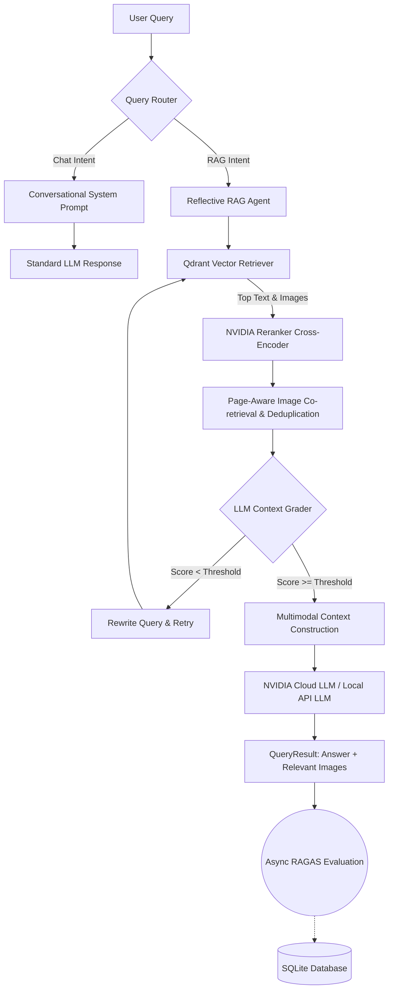

# Self-Reflective Multimodal RAG Agent


This project is a powerful, locally-hosted **Multimodal Retrieval-Augmented Generation (RAG) with Self Reflection web application**. It is designed to ingest complex file types (especially multi-column PDFs with embedded charts/diagrams, and independent images) and perform intelligent search and visual understanding. It achieves this by coupling local embedding models with high-performance cloud LLMs (like NVIDIA NIM and OpenAI endpoints).

---

## 🚀 Key Features

*   **Self-Reflective RAG Agent:** Implements an autonomous evaluation loop. Before answering, the agent grades the retrieved context using a fast LLM (e.g. Llama 3.1 8B). If the context is inadequate, it rewrites the query and retries retrieval, preventing hallucinations and drastically improving accuracy.
*   **Intelligent Query Routing:** A classifier categorizes queries as conversational (`chat`) or document-grounded (`rag`). This bypasses expensive vector DB lookups for casual greetings and dynamically falls back to conversation if RAG yields no context.
*   **Advanced Document Parsing (`Docling`):** Employs custom PDF parsing to extract intricate tables and diagrams that standard text parsers completely miss.
*   **AI Image Captioning:** Extracted images are passed through a Vision LLM for automated captioning. Both the CLIP image embedding and HuggingFace text embedding of the caption are indexed, ensuring total searchability.
*   **NVIDIA Reranking & Page-Aware Co-retrieval:** Initially retrieves a wide net of text nodes, reranks them using `nv-rerank-qa-mistral-4b`, and identifies the highest-scoring source pages. It then forcefully co-retrieves any diagrams existing on those specific pages to provide rich visual context to the LLM.
*   **Content-Based Image Deduplication:** Utilizes `PIL` thumbnailing and MD5 pixel-hashing to strip duplicate visuals (e.g., repeating corporate headers) before they hit the LLM context window.
*   **Dual-Pipeline UI:** A beautiful, responsive Streamlit frontend powered by a robust FastAPI backend.
*   **Automated RAGAS Evaluation:** An asynchronous background evaluation pipeline that natively scores every RAG query against `faithfulness`, `answer_relevancy` and `correctness` using a dedicated Evaluation LLM, persisting results to an SQLite database.
*   **Built-in Analytics Dashboard:** A seamlessly integrated Streamlit dashboard to monitor rolling average metrics, track scores over time via dynamic charts, and review individual query performance.

---

## 🧠 Architecture & Workflow



---

## 🛠️ Technical Stack

- **Vector Database**: locally-persistent [Qdrant](https://qdrant.tech/) Collections
- **Evaluation Database**: Local SQLite (`eval_results.db`)
- **Backend API**: [FastAPI](https://fastapi.tiangolo.com/) handling batch multiprocessing and retrieval.
- **Frontend UI**: [Streamlit](https://streamlit.io/) boasting a custom injected pure CSS glassmorphic aesthetic.
- **Evaluation Engine**: [Ragas](https://docs.ragas.io/) for asynchronous, reference-free metric scoring.
- **RAG Engine**: [LlamaIndex](https://www.llamaindex.ai/) natively composing:
  - **Text Embeddings**: Local HuggingFace inference (`BAAI/bge-small-en-v1.5`)
  - **Vision/Image Embeddings**: Local OpenAI CLIP (`clip-vit-base-patch32`)
  - **LLMs**: NVIDIA NIM (`google/gemma-3-27b-it`) with OpenAI fallbacks.
  - **Document Parsing**: Docling, PIL

---

## ⚙️ Setup & Installation

Below are the steps for execution in your workspace repository root.

### 1. Prerequisites 
- Ensure **Python 3.9+** and Git are installed.
- Ensure your Virtual Environment is activated.

### 2. Install Project Dependencies
Run the installation script within your virtual environment:
```bash
pip install -r requirements.txt
```
*(Note: If LlamaIndex demands CLIP, run: `pip install torch torchvision git+https://github.com/openai/CLIP.git`)*

### 3. API Authorization
Depending on your `config.py` setup, you must export the appropriate API keys.
If using NVIDIA NIM (default configuration):
```powershell
# Windows PowerShell
$env:NVIDIA_API_KEY="nvapi-..."
```
If using OpenAI fallback:
```powershell
$env:OPENAI_API_KEY="sk-..."
```

---

## 🚀 Operating Instructions

Because of the decoupled architecture, executing the application requires spinning up two independent servers.

### 1. Start the FastAPI Backend Engine
Open your terminal *(making sure the virtual environment and environment variables are loaded)* and execute `uvicorn`:

```bash
uvicorn main:app --host 127.0.0.1 --port 8000 --reload
```
> **Note**: During the very first launch, HuggingFace will securely download the multi-gigabyte text and image vector encoders directly caching them. Depending on your network, this may take a few minutes.

### 2. Start the Streamlit Frontend
Open up a **second distinct terminal** (reactivate the virtual environment) and instruct the Streamlit application to start:

```bash
streamlit run ui.py
```

The terminal should output a local network IP block. Open your web browser to:
[http://localhost:8501](http://localhost:8501)

### 3. Usage Guide
1. Use the **"Navigation"** sidebar to switch between the Chat Assistant and the Eval Dashboard.
2. In the Chat Assistant view, expand the **"Knowledge Base"** sidebar.
3. Upload your PDF documents or stand-alone images.
4. Click **"Ingest Files"**. The system will chunk text, parse complex layouts, caption images, and build the Qdrant index.
5. Ask complex, document-grounded questions. The system will answer, and then asynchronously grade its own performance in the background without adding any latency!
6. Navigate to the **"Eval Dashboard"** to see your real-time performance metrics, line charts, and colored dataframe.

---

## 🔮 Future Roadmap
- Implement an LLM-based query intent classifier instead of rule-based heuristics.
- Integrate local, offline multimodal inference models (e.g., LLaVA) via Ollama.
- Implement hybrid search (BM25 + Vector) directly natively within the Qdrant retriever.